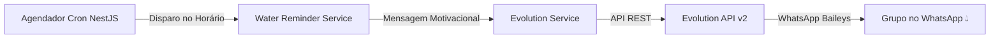

# 💧 Water Reminder Bot (Nest.js + Evolution API)

Bot inteligente em **Nest.js** integrado à **Evolution API** para conectar o WhatsApp e enviar lembretes automáticos e dinâmicos para beber água em um grupo ou conversa específica.

---

## 🚀 Como Funciona



1. **Evolution API**: gerencia a conexão do seu WhatsApp e o envio das mensagens.
2. **Nest.js**: gerencia os agendamentos via Cron, rotatividade de mensagens motivacionais de hidratação e disponibiliza interface web para escanear o QR Code e listar seus grupos.

---

## 📋 Pré-requisitos

- **Node.js**: v18+ (recomendado v20+)
- **Docker & Docker Compose**: para rodar a Evolution API localmente (opcional se você já tiver uma Evolution API externa)

---

## ⚡ Passo a Passo de Inicialização Rápida

### 1. Subir a Evolution API (via Docker)
No terminal, dentro da pasta do projeto (`water-reminder-bot`), execute:

```bash
docker compose up -d
```
> Isso iniciará os containers da **Evolution API v2**, **PostgreSQL** e **Redis**. A API estará disponível em `http://localhost:8080`.

### 2. Iniciar a Aplicação Nest.js
Instale as dependências (caso ainda não tenha feito) e inicie o bot em modo de desenvolvimento:

```bash
npm install
npm run start:dev
```

### 3. Conectar seu WhatsApp
Abra o navegador no seguinte endereço:
👉 **[http://localhost:3000/evolution/qrcode](http://localhost:3000/evolution/qrcode)**

1. No celular, abra o WhatsApp.
2. Vá em **Aparelhos Conectados** > **Conectar um aparelho**.
3. Aponte a câmera para o QR Code exibido na tela do navegador.
4. A tela atualizará automaticamente para o status **Conectado**!

### 4. Obter o ID (JID) do Grupo de Alerta
Com o WhatsApp conectado, acesse no navegador:
👉 **[http://localhost:3000/evolution/groups](http://localhost:3000/evolution/groups)**

Você verá a lista de todos os seus grupos com o respectivo `id` (ex: `120363023456789012@g.us`). Copie o `id` do grupo onde deseja receber os alertas.

### 5. Configurar o Grupo no `.env`
Abra o arquivo `.env` e cole o ID copiado:

```env
WATER_TARGET_GROUP_JID=120363023456789012@g.us
```

Pronto! O bot já está ativo e enviará mensagens no cronograma definido.

---

## ☁️ Deploy no EasyPanel

O projeto está 100% pronto para rodar no **EasyPanel**. Você tem duas opções práticas:

### Opção 1: Usando Serviço do Tipo "Compose" (Recomendada)
1. No painel do seu EasyPanel, entre no seu Projeto e clique em **+ Project Service** > **Compose**.
2. Cole o conteúdo do arquivo [docker-compose.easypanel.yml](file:///home/vinicius/Repositorios/water-reminder-bot/docker-compose.easypanel.yml).
3. Na aba **Environment** do serviço no EasyPanel, defina as variáveis:
   - `SERVER_URL`: URL pública com HTTPS da sua Evolution API (ex: `https://evolution.seudominio.com`).
   - `EVOLUTION_API_KEY`: uma chave forte aleatória (ex: `B6D711FCDE4D4FD5936544120E713976`).
   - `WATER_TARGET_GROUP_JID`: JID do seu grupo no WhatsApp (ex: `120363411123140601@g.us`).
4. Clique em **Deploy**! O EasyPanel cuidará do build automático, banco PostgreSQL, Redis, Evolution API e do Bot Nest.js com certificados SSL automáticos.

### Opção 2: Usando Serviço do Tipo "App" (Build via GitHub)
1. Crie um serviço **App** apontando para o seu repositório no GitHub.
2. O EasyPanel detectará automaticamente o [Dockerfile](file:///home/vinicius/Repositorios/water-reminder-bot/Dockerfile) multi-stage otimizado.
3. Configure as variáveis de ambiente apontando para a sua Evolution API (`EVOLUTION_API_URL` e `EVOLUTION_API_KEY`).
4. Clique em **Deploy**.

---

## ⚙️ Configurações do Agendador (.env)

| Variável | Padrão | Descrição |
| :--- | :--- | :--- |
| `PORT` | `3000` | Porta HTTP do Nest.js |
| `EVOLUTION_API_URL` | `http://localhost:8080` | URL da Evolution API |
| `EVOLUTION_API_KEY` | `429683C4...` | Chave de autenticação global |
| `EVOLUTION_INSTANCE_NAME` | `water-bot` | Nome da instância do WhatsApp |
| `WATER_TARGET_GROUP_JID` | *(vazio)* | JID do grupo WhatsApp de destino |
| `WATER_REMINDER_CRON` | `0 8-20/1 * * *` | Expressão cron de envio |
| `WATER_REMINDER_ENABLED` | `true` | Ativa ou pausa os alertas automáticos |

### Exemplos de Expressão Cron:
- `0 8-20/1 * * *` -> A cada 1 hora entre as 08:00 e 20:00 (todos os dias).
- `0 */2 * * *` -> A cada 2 horas o dia todo.
- `*/30 8-19 * * *` -> A cada 30 minutos em horário comercial.

---

## 📡 Endpoints Disponíveis

### Conexão e Evolution API
- **`GET /evolution/qrcode`**: Interface web para escanear o QR Code de conexão.
- **`GET /evolution/qrcode/json`**: Retorna os dados brutos do QR Code em JSON.
- **`GET /evolution/status`**: Status da conexão da instância.
- **`GET /evolution/groups`**: Lista todos os grupos que o bot participa com seus respectivos IDs.
- **`POST /evolution/send-test`**: Envia uma mensagem arbitrária para qualquer destinatário.
  ```json
  { "to": "120363...g.us", "text": "Mensagem de teste" }
  ```

### Lembrete de Água
- **`GET ou POST /reminder/trigger`**: Dispara imediatamente um alerta de água para o grupo configurado (ótimo para testar direto pelo navegador em http://localhost:3000/reminder/trigger).
  - Parâmetro opcional: `?target=120363...g.us`
- **`GET /reminder/status`**: Estatísticas de envio (total enviado hoje, último disparo, status).
- **`GET /reminder/preview`**: Mostra os modelos de mensagens de hidratação pré-cadastrados.

---

## 🧪 Testes

Para rodar os testes unitários:

```bash
npm test
```

Para compilar para produção:

```bash
npm run build
npm run start:prod
```
